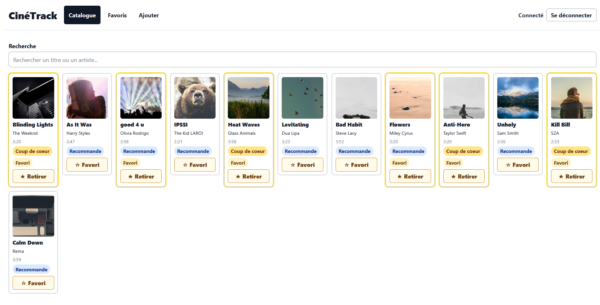

# CineTrack

CineTrack est une application Angular de catalogue musical. Elle permet de chercher des morceaux, afficher une fiche detaillee, se connecter, puis creer, modifier et supprimer des morceaux via une API protegee.



## Lancer le projet

Installer les dependances :

```bash
npm install
```

Lancer l'application Angular :

```bash
npm start
```

L'application appelle l'API configuree dans `src/environments/environment.ts` :

```ts
export const environment = { apiUrl: 'http://localhost:3000' };
```

L'API doit donc etre disponible sur `http://localhost:3000`.

## Fonctionnalites

- Consultation du catalogue de morceaux.
- Recherche par texte.
- Affichage d'une fiche detaillee.
- Connexion utilisateur.
- Routes protegees pour les actions reservees aux utilisateurs connectes.
- Intercepteur HTTP qui ajoute le token `Bearer`.
- Intercepteur HTTP global pour journaliser les erreurs API.
- Creation, edition et suppression de morceaux via l'API.
- Gestion des favoris avec persistance API.

## F12 - CRUD authentifie

F12 branche le formulaire sur l'API. Avant, le formulaire creait un morceau en local puis redirigeait. Maintenant, les actions passent par `TrackService`.

Dans `src/app/services/track.service.ts` :

```ts
create(track: TrackPayload) {
  return this.http.post<Track>(this.baseUrl, track);
}

update(id: number, changes: Partial<Track>) {
  return this.http.patch<Track>(`${this.baseUrl}/${id}`, changes);
}

remove(id: number) {
  return this.http.delete<void>(`${this.baseUrl}/${id}`);
}
```

Le type utilise pour la creation est declare dans `src/app/models/track.ts` :

```ts
export type TrackPayload = Omit<Track, 'id'>;
```

Cela veut dire : "un morceau sans son `id`". En creation, l'API est responsable de generer l'identifiant.

## Explication du flux

1. L'utilisateur se connecte depuis la page login.
2. `AuthService` stocke le token recu.
3. `authInterceptor` ajoute automatiquement `Authorization: Bearer <token>` aux requetes HTTP.
4. Les routes `/tracks/new` et `/tracks/:id/edit` sont protegees par `authGuard`.
5. Le formulaire appelle `create()` en creation ou `update()` en edition.
6. Apres une ecriture reussie, Angular redirige vers `/tracks`.
7. Depuis la fiche detaillee, un utilisateur connecte peut modifier ou supprimer le morceau.

## F13 - Gerer les erreurs et livrer

F13 ajoute un intercepteur d'erreurs global. Il passe sur toutes les reponses HTTP en erreur et affiche un message clair dans la console.

L'ordre est important :

1. `authInterceptor` ajoute le token `Bearer`.
2. `errorInterceptor` gere les erreurs de la requete.

Pour produire la version livrable :

```bash
npm run build
```

Angular genere le dossier de production dans :

```txt
dist/cinetrack/browser
```

Ce dossier peut ensuite etre deploye sur un hebergeur statique comme Netlify, GitHub Pages ou un serveur web classique.

Pour une application Angular avec routes cote client, il faut penser au fallback SPA : toutes les URLs doivent renvoyer vers `index.html`. Sinon, une URL comme `/tracks/2` peut fonctionner dans Angular mais afficher une erreur 404 apres rechargement de la page.

## Fonctionnalite Favoris

La fonctionnalite Favoris permet de marquer ou retirer un morceau des favoris. Le champ utilise existe deja dans le modele :

```ts
favorite: boolean;
```

Le service expose deux methodes :


Le bouton Favori appelle donc un `PATCH` via la methode `update()` deja creee en F12. On ne renvoie pas tout le morceau : on modifie seulement le champ `favorite`.

Une route dediee affiche les morceaux favoris :

```txt
/favorites
```

Le menu contient maintenant :

```txt
Catalogue | Favoris | Ajouter
```

Le bouton Favori est disponible quand l'utilisateur est connecte, car la modification passe par l'API authentifiee.

## Structure utile

- `src/app/models/track.ts` : modele `Track` et type `TrackPayload`.
- `src/app/services/track.service.ts` : appels API de lecture et d'ecriture.
- `src/app/track-form/` : formulaire de creation et d'edition.
- `src/app/track-detail/` : fiche detaillee avec actions modifier/supprimer.
- `src/app/track-favorites/` : page dediee aux morceaux favoris.
- `src/app/interceptors/auth.interceptor.ts` : ajout du token `Bearer`.
- `src/app/interceptors/error.interceptor.ts` : gestion globale des erreurs HTTP.
- `src/app/guards/auth.guard.ts` : protection des routes authentifiees.
- `src/app/app.routes.ts` : routes principales de l'application.

## Commandes utiles

```bash
npm start
npm run build
npm test
```
